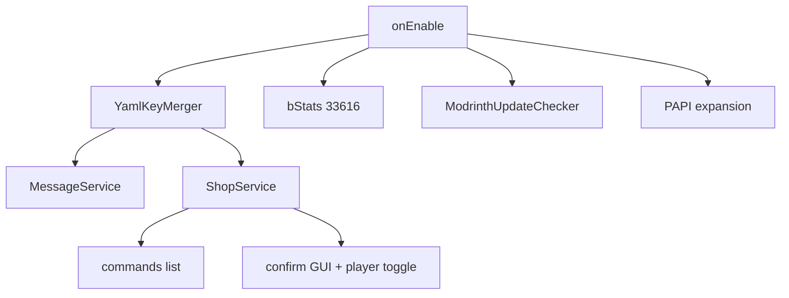

# DonutShards 1.4.0 — features, checklist, Apache OSS, publish

## Overview

Ship **DonutShards 1.4.0** with Discord fixes/features (YAML key merge, shop commands, confirmation toggle, PAPI), NightBeam checklist (bStats **33616**, MC **1.20.1–26.2**, loaders, Modrinth update check), **Apache-2.0** OSS cleanup, then commit, tag, and publish to Modrinth (`4krPhA6H`) / CurseForge (`1606311`).

Current: **1.3.0**. Target: **1.4.0**.

## Scope

| Source | Work |
|--------|------|
| closed-0045 / ticket-0047 | Merge missing keys into existing YAML; messages like `afk-joined` / `afk-left` appear after upgrade |
| ticket-0165 | Shop `commands:`; `/shards confirmation <on\|off>` (+ `shard` alias); PAPI `%donutshard_*%` |
| Checklist | bStats 33616; Paper/Folia/Purpur/Spigot/Bukkit; MC 1.20.1–26.2; Modrinth update checker |
| apache-oss-cleanup | Replace proprietary `LICENSE.md` with Apache-2.0 `LICENSE` + NOTICE/CONTRIBUTING/CoC/SECURITY |
| Delivery | Commit, tag `v1.4.0`, push, local publish, Discord ticket replies |

## Audit notes ([Explore DonutShards gaps](0459eba6-57cb-46a3-b258-70af364b9e1b))

Confirmed in-tree:

- Merge claim in YAML comments is **unimplemented**; Configurate is a dependency but unused.
- `afk-joined` / `afk-left` are wired in `CommandRouter`; missing on upgraded disks → red “Missing message: …” (not MiniMessage `<zone>` conflict).
- `shop.yml` `confirmation:`, `gui.yml` confirm/cancel slots, and `transfer.confirmation-threshold` are **dead config**.
- Tab-complete lists `top` / `history` / several admin verbs that are not implemented — either implement minimal `/shards top` for PAPI consistency or trim tab-complete in 1.4.0.
- `rewards.yml` / `anti-abuse.yml` are extracted but not loaded (rewards live under `config.yml`); still merge missing keys so future versions can adopt them.
- Single **1.4.0** release (patch bugs + ticket features); skip a separate 1.3.1.

## 1. Config / messages merge

**Root cause:** `DonutShardsPlugin` only `saveResource(..., false)` when a file is missing. Existing installs never get new keys.

**Fix — `YamlKeyMerger` / `ConfigMigrationService`:**

1. For each managed YAML (`config.yml`, `messages.yml`, `database.yml`, `rewards.yml`, `zones.yml`, `shop.yml`, `gui.yml`, `anti-abuse.yml`, `kills.yml`): missing → extract; present → deep-merge **missing keys only** from jar defaults (never overwrite operator values).
2. Prefer Configurate (already shaded) if it preserves structure; else Bukkit set-if-absent + save. Optionally bump `schema-version` when merging.
3. Run on enable and on `/shardmanager reload`.
4. Tests: old `messages.yml` without `afk-joined` gains it; `prefix` unchanged. Render test for `<zone>` placeholders.

## 2. Shop commands + confirmation (ticket-0165)

Today `confirmation:` in `shop.yml` is ignored; no `commands:`; purchase is immediate. **“Shop command execution”** means console/player commands defined on shop items, not new `/shardshop` subcommands.

**Extend `ShopItem` / `ShopCatalog`:**

- `confirmation` (bool, default false)
- `commands` (string list) — run as **console** after successful purchase; placeholders `%player%`, `%uuid%`, `%item%`, `%price%`

**Player toggle:** `/shards confirmation <on|off>` (add alias `shard`). Persist in `player-prefs.yml`. When off, skip confirm GUI for **all** items (overrides per-item confirmation). Status MiniMessage keys `confirmation-enabled` / `confirmation-disabled`.

**Confirm GUI:** load Confirm/Cancel materials/slots from `gui.yml` (already shipped defaults); open when `item.confirmation && prefs.enabled`. Wire or document `transfer.confirmation-threshold` only if pay-confirm is in scope — **out of scope for ticket-0165** unless cheap; do not leave silent dead keys in docs without noting.

## 3. PlaceholderAPI

Soft-depend already declared; no expansion class. Add `compileOnly` PlaceholderAPI. Implement expansion (ticket spelling):

| Placeholder | Meaning |
|-------------|---------|
| `%donutshard_balance%` | Viewer balance |
| `%donutshard_top_<1-10>%` | Name at rank N |
| `%donutshard_top_bal_<1-10>%` | Balance at rank N |

Register only if PAPI present. Implement a real leaderboard query (or minimal `/shards top`) so top placeholders are not empty stubs.

## 4. NightBeam checklist

- **bStats 33616:** shade/relocate `org.bstats` → `com.nightbeam.donutshards.lib.bstats`; `bstats: true` in config.
- **Matrix:** keep Paper API 1.20.1 + `folia-supported: true`; add `release/supported-minecraft.json` (loaders + full versions); README claims Paper/Folia/Purpur/Spigot/Bukkit · 1.20.1–26.2; release jar name → `…-mc1.20.1-26.2.jar`.
- **Modrinth update check:** async against project `4krPhA6H`; op notify; `update-check: true` toggle.

## 5. Apache OSS cleanup

- Official Apache-2.0 `LICENSE` (replace proprietary `LICENSE.md`); `NOTICE` (NightBeam / 2026).
- `CONTRIBUTING.md`, `CODE_OF_CONDUCT.md`, `.github/SECURITY.md`.
- Slim README; refresh stale MODRINTH/CURSEFORGE “PAPI not done” text.
- Keep `.github/workflows/publish.yml`; untrack `releases/*.jar` if committed; tighten `.gitignore`.
- `plugin.yml` author → `NightBeam`. No package renames.

## 6. Ship

- Patch notes + CHANGELOG; `gradlew test` + `release`.
- Commit, tag `v1.4.0`, push.
- `node scripts/publish-local.mjs --version 1.4.0` with **full** game_versions + paper+folia (fix script if still single-version).
- Discord ticket-0047 + ticket-0165 replies.

## Must not change

- SQL ledger schema (unless read-only leaderboard query already exists).
- Folia scheduler abstraction.
- Vault conversion semantics.

## Implementation order

1. YamlKeyMerger + tests  
2. Shop confirmation + commands + prefs  
3. PAPI expansion  
4. bStats + update checker + matrix docs  
5. Apache OSS cleanup  
6. 1.4.0 packaging → commit/tag/publish → Discord  

## Approval

Reply **go** / **implement** to execute this plan (commit + publish included as you requested earlier).
